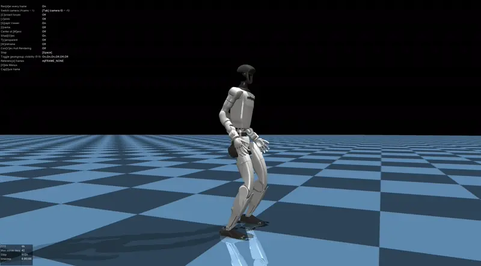
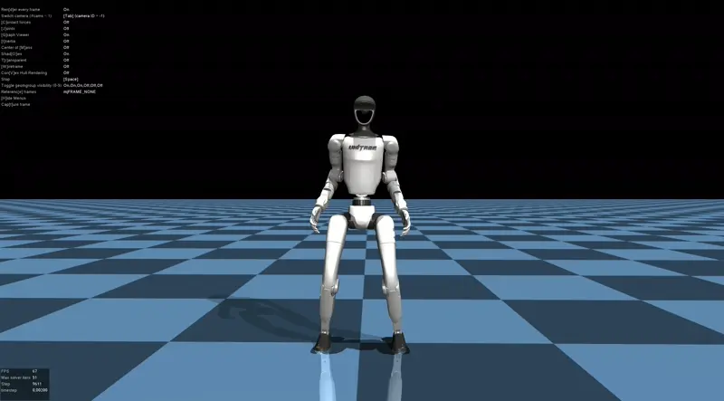
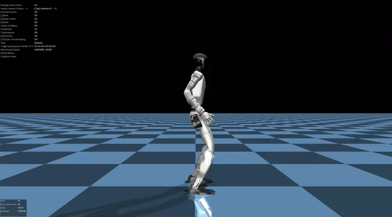
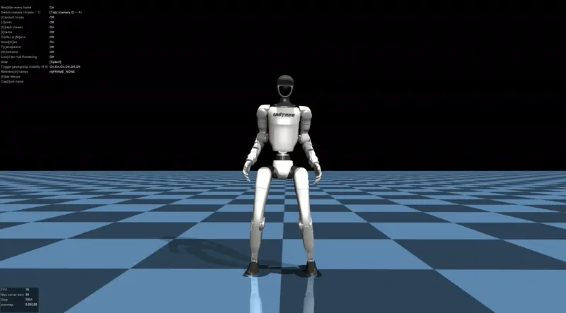
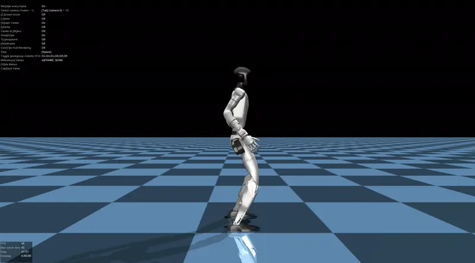
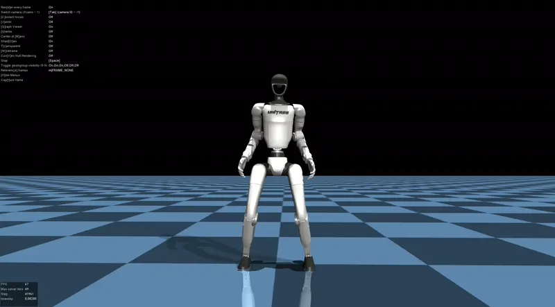
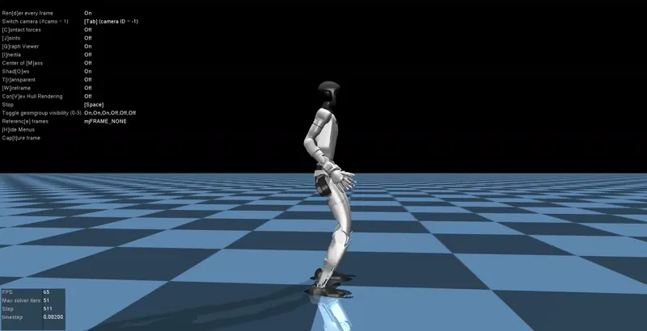

<h1 align="center">AMO: Adaptive Motion Optimization for Hyper-Dexterous Humanoid Whole-Body Control</h1>

<p align="center">
    <a href="https://rexskywalkerlee.github.io/"><strong>Jialong Li*</strong></a>
    .
    <a href="https://chengxuxin.github.io/"><strong>Xuxin Cheng*</strong></a>
    ·
    <a href="https://tiianshu.github.io/"><strong>Tianshu Huang*</strong></a>
    <br>
    <a href="https://aaronyang1223.github.io/"><strong>Shiqi Yang</strong></a>
    ·
    <a href="https://rogerqi.github.io/"><strong>Ri-Zhao Qiu</strong></a>
    ·
    <a href="https://xiaolonw.github.io/"><strong>Xiaolong Wang</strong></a>
</p>

<p align="center">
    
</p>

<h3 align="center"> RSS 2025 </h3>

<p align="center">
<h3 align="center"><a href="https://amo-humanoid.github.io/">Website</a> | <a href="https://arxiv.org/abs/2505.03738/">arXiv</a> | <a href="">Video</a> | <a href="">Summary</a> </h3>
  <div align="center"></div>
</p>

## Introduction
This script allows you to interact with our model and visualize it in the MuJoCo simulator—feel free to give it a try!

## Installation
```bash
conda create -n amo python=3.8
conda activate amo
pip install -r requirements.txt
```
To run the script, simply put
```
python play_amo.py
```


## Guidelines

Press **Z** (+) and **X** (-) to control torso height (I.D. range: [-0.5, 0.8])



Press **J** (+) and **U** (-) to control torso yaw (I.D. range: [-1.57, 1.57])



Press **K** (+) and **I** (-) to control torso pitch (I.D. range: [-0.52, 1.57])



Press **L** (+) and **O** (-) to control torso roll (I.D. range: [-0.7, 0.7])



Press **W** (+) and **S** (-) to control *Vₓ* (I.D. range: [-0.5, 0.5])



Press **Q** (+) and **E** (-) to control *Vᵧ* (I.D. range: [-0.4, 0.4])



Press **A** (+) and **D** (-) to control yaw


You can experiment with different command combinations, including out-of-distribution (O.O.D.) ones, all using the same model. You can even include arm motions on top of it! (Press **T** to toggle arm actions)



Enjoy!

## ‼️Alert & Disclaimer
Deploying these models on physical hardware can be hazardous. [This video](https://x.com/cixliv/status/1918028255095099750) demonstrates how sim‑to‑real transfer failures can cause serious damage. Unless you have deep sim‑to‑real expertise and robust safety protocols, we strongly advise against running the model on real robots. These models are supplied for research use only, and we disclaim all responsibility for any harm, loss, or malfunction arising from their deployment.

## Citation
```
@article{li2025amo,
title={AMO: Adaptive Motion Optimization for Hyper-Dexterous Humanoid Whole-Body Control},
author={Li, Jialong and Cheng, Xuxin and Huang, Tianshu and Yang, Shiqi and Qiu, Rizhao and Wang, Xiaolong},
journal={Robotics: Science and Systems 2025},
year={2025}
}
```
