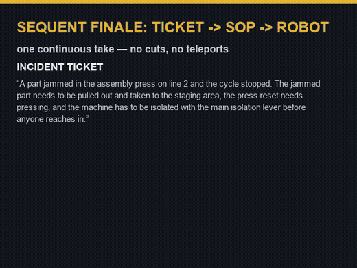
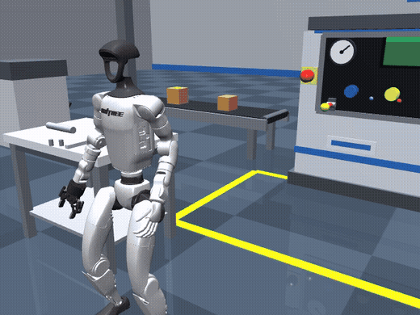
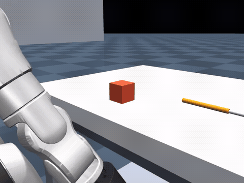
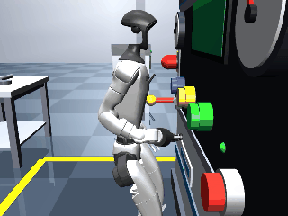

# Sequent

A simulated Unitree G1 humanoid that takes a plant-floor incident ticket written in plain language, retrieves the right Standard Operating Procedure from a library of 1,012, turns it into a step-by-step plan, and executes that plan in one continuous MuJoCo simulation. Every step is verified against measured physics rather than the policy's own claim, and when a step fails, the system says so on camera.

<p align="center">
  
</p>

<p align="center">
  <a href="https://sequentrobotics.com">Project site</a> ·
  <a href="docs/PAPER.md">Paper</a> ·
  <a href="TRAINING_LOG.md">Training log</a>
</p>

## What it does

The full loop, in one run:

> operator ticket → retrieval over 1,012 SOPs → faithful plan (one skill per written SOP step) → execution on the G1 (AMO whole-body controller for the legs, Robotiq 2F-85 gripper on the right wrist) → per-step physics verification → final verdict

<p align="center">
  
</p>

In the final demonstration, the retriever returns the correct SOP at rank 1 (score 0.897) over the full corpus, the planner maps its written steps one-to-one onto the robot's skill vocabulary, and the robot executes the plan in a single unbroken simulation:

| Step | Skill | Measured outcome | Verdict |
|---|---|---|---|
| 1 | pick | box gripped (force-gated latch), lifted, held | PASS |
| 2 | carry / place | carried to the panel station, placed upright | PASS |
| 3 | press_button | 33.8 mm press, held, no re-press pumping | PASS |
| 4 | lever | reached 0.443 rad; success requires under 0.25 rad | **FAIL** |
| 5 | notify | operator notified with the per-step verdict card | PASS |

The system's own verdict card reads "PARTIALLY RESOLVED". The lever step failed and is reported as failed. Reporting failed steps honestly is the point of the verification layer; a demo that cannot fail is not verifying anything.

## The demos

**One-take loco-manipulation chain.** Walk to the table, pick the box, carry it 2.8 m including a 180 degree turn, place it at the panel station, press the button with the RL policy (34.5 mm, no pumping), return to rest. One continuous simulation, not clips.

<p align="center">
  <br>
  
</p>

**Pick: a controller, not RL.** Damped-least-squares IK servos the gripper to the object; a latch engages only when measured pad contact forces confirm a real two-sided grip. 11 of 12 held lifts in validation, 11.9 cm held lift in the continuous demo. The block stays on the table until it is actually lifted.

<p align="center">
  
</p>

**Button press: RL with a curriculum.** The arm starts at the true rest pose and reaches about 19 cm to press, with no IK seed at test time. The deterministic policy is 8/8 across near and far starts, pressing 29 to 40 mm and holding.

<p align="center">
  
</p>

**Lever: partial, and reported as such.** The RL lever policy completes the pull about half the time and the motion is visibly rough. The structural cause is identified (a per-episode reach bias the policy cannot observe) and the fix is designed but not executed. The finale's lever trace is below; no take reaches the success band.

<p align="center">
  
</p>

## Architecture

One thesis, adopted from measured results rather than picked up front:

> Controllers for kinematics. Reinforcement learning for contact-rich interaction. Verification above both.

- **Walking** is the frozen AMO whole-body controller (Ze et al., RSS 2025) wrapped in a closed-loop yaw servo, because AMO as wired cannot turn in place and crabs about 18 degrees while walking.
- **Picking** is a controller. RL grasp-and-lift scored 0% verified success across roughly ten reward configurations; the "lifts" the training metric counted were the box popping ballistically out of a crushing pinch. The IK-plus-latch controller held the lift on 11 of 12 attempts on its first day.
- **Pressing and pulling** are RL (SB3 PPO), because how hard to push a spring-loaded button or drive a latched lever through its arc is a contact problem a controller cannot easily script.
- **The verifier** does not care which produced the motion. Every skill runs inside a pre/postcondition contract measured from `mjData`: robot upright, button displaced past threshold and held, box supported for a sustained window. A step that fails its postcondition is reported as failed.

The brain is a fine-tuned 22.7M-parameter MiniLM bi-encoder trained on 1,859 operator-voice incidents. On the held-out test set (269 incidents against the full 1,012-SOP index):

| Method | R@1 | R@5 | MRR |
|---|---|---|---|
| TF-IDF (lexical baseline) | 0.301 | 0.535 | 0.408 |
| **Fine-tuned bi-encoder (ours)** | **0.584** | **0.851** | **0.697** |
| + off-the-shelf cross-encoder reranker | 0.442 | 0.833 | 0.604 |

Two negative results shaped the design: a from-scratch bert-base retriever lost to keyword search, and a generic reranker made the strong retriever worse, so it was removed. The planner is deterministic and faithful by construction (one skill per written SOP step) after a fine-tuned Flan-T5 planner produced 0 valid plans out of 20.

<p align="center">
  
</p>

## What went wrong, on purpose in the open

Every reward hack in this project was caught by a human watching rendered rollouts. None was caught by a metric. The catalog is in the [paper](docs/PAPER.md), section 5.8: parking short of the button to farm proximity income, sitting in the lever's free travel to collect an annuity, press-release-press pumping, air-swinging while the hold counter ran, flailing fast enough that press income outweighed the jerk penalty, and the ballistic box pop that fooled the lift metric. Each one was fixed at the root (terminate what can be farmed, constrain what can be hacked at the control level, re-baseline free income) rather than patched with another penalty.

The most expensive single lesson: before debugging rewards, check that the action space can physically express the task. The arm's action envelope was 0.5 rad per joint while the rest-to-contact offsets the tasks require run up to 1.1 rad. Every far-start attempt saturated silently at the actuator clamp, and no reward change could have fixed it.

## Repository layout

| Path | What |
|---|---|
| `final_ticket_demo.py` | The finale: ticket → brain → five-skill one-take run with on-screen verification |
| `g6_onetake.py` | The one-take walk → pick → carry → place → press chain |
| `run_task.py` | Front door: natural-language incident → retrieved SOP → plan → verified execution |
| `brain/` | SOP retrieval and planning: bi-encoder retriever, faithful planner, skill registry |
| `brain_bridge.py`, `llm_planner.py` | Runtime bridge into the robot process; hybrid semantic+lexical retrieval with an optional LLM picker |
| `verifier.py`, `executor.py` | Skill contracts: physics-checked pre/postconditions against `mjData`; the verifying executor |
| `ik_pick.py`, `pick_table.py` | The pick controller: DLS IK plus the force-gated latch |
| `train_button.py`, `train_lever.py`, `train_lever_bc.py` | RL training: curriculum press, lever BC → DAgger → PPO |
| `unified_env.py`, `build_unified_model.py` | The unified embodiment: walking AMO G1 with the Robotiq gripper on the right wrist |
| `g1.xml`, `meshes/`, `amo_jit.pt` | G1 model, meshes, and the frozen AMO controller |
| `docs/PAPER.md`, `docs/paper.tex` | The project writeup, with figures in `docs/figures/` |
| `TRAINING_LOG.md`, `AZURE_COST_LOG.md` | Per-run results and cloud spend |

## Quickstart

```bash
pip install -r requirements.txt

# natural-language incident -> retrieved SOP -> plan -> verified execution
python run_task.py --command "Machine A pressure is low"

# the one-take chain (renders _g6_onetake.mp4)
python g6_onetake.py

# the full finale (renders _final_ticket.mp4)
python final_ticket_demo.py
```

Python 3.10, MuJoCo 3.2.3, Stable-Baselines3 2.1.0. Training ran on 24 to 56 parallel MuJoCo environments on a 64-core Azure VM; one flag mattered enough to mention: cap `OMP_NUM_THREADS=1` per worker or 32 AMO workers will thrash the cores (18 steps/s against about 2,600 with the cap).

## Methodology

Every number in this repository was measured on our own runs. Two early results were retracted when they failed that bar: a planner metric that turned out to be a hardcoded placeholder in an eval script, and a grasp result trained on a broken simulation. No run is logged as a success until its deterministic rollout has been watched. Where a component is unreliable, the number says so.

## Credits

Built by [Jatin Sikka](https://sequentrobotics.com). The AMO whole-body controller is due to Ze et al. (RSS 2025) and is used frozen. Apache 2.0.
