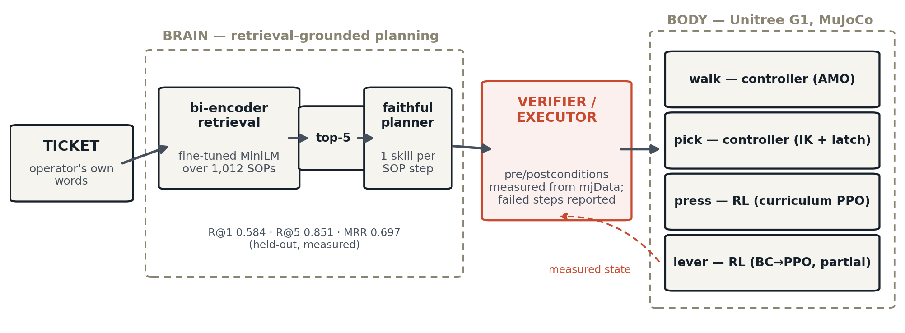
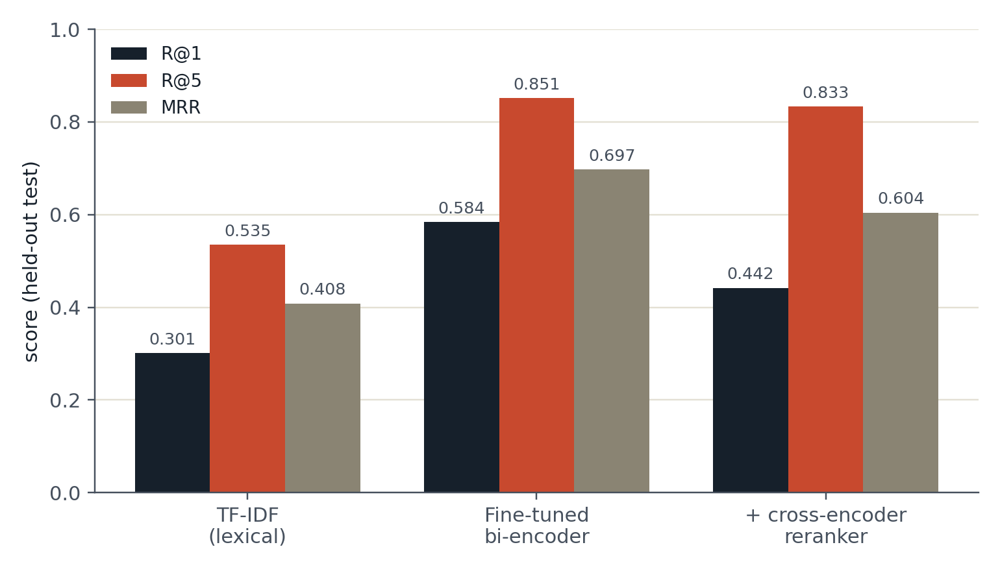
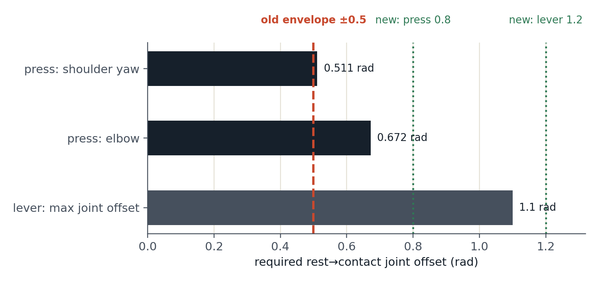
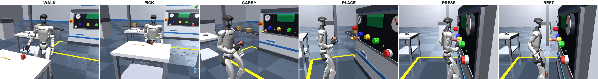
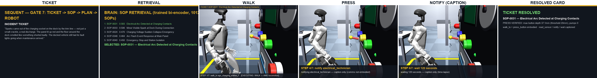
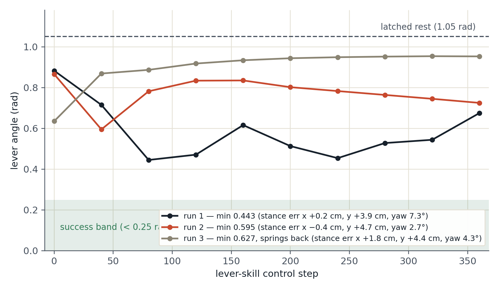

# Sequent: SOP-Driven, Physics-Verified Loco-Manipulation on a Simulated Humanoid, from Ticket to Task-Execution with Retrieval-Grounded Planning and Curriculum RL

**Jatin Sikka**
Sequent Robotics · sequentrobotics.ai

---

## Abstract

We present Sequent, an end-to-end system that takes a plant-floor incident ticket written in an operator's own words, retrieves the correct Standard Operating Procedure (SOP) from a library of 1,012 procedures, converts it into a faithful step-by-step plan, and executes that plan on a simulated Unitree G1 humanoid (walking, picking, carrying, placing, pressing a button, and partially pulling a lever) in one continuous MuJoCo simulation, with every step verified against measured physics rather than the policy's own claim. The "brain" is a fine-tuned 22.7M-parameter sentence bi-encoder that reaches Recall@1 0.584 / Recall@5 0.851 / MRR 0.697 on a held-out test set where lexical TF-IDF scores 0.301 / 0.535 / 0.408; along the way, a from-scratch bert-base retriever lost to TF-IDF and an off-the-shelf cross-encoder reranker *hurt* a strong retriever (R@1 0.57 → 0.44); in our experiments the training recipe mattered more than model size. The "body" follows an explicit architecture thesis: classical controllers for kinematics (walking, IK-based picking), reinforcement learning for contact-rich interaction (button press, lever pull), and a physics verifier above both. This division was chosen based on the results in Section 4.2: RL grasping scored 0% verified success across ~10 reward configurations, the "lifts" recorded by the training metric were the box popping ballistically out of a crushing pinch, and grasping was replaced by an IK controller with a force-gated latch. The paper documents the RL manipulation work in detail: a curriculum plus behavior-cloning warm-starts (used twice, with measured limits), an action envelope physically too small to express the task, a catalog of reward hacks (parking, seat farming, pumping, air-swinging, penalty-hacked smoothness, metric-fooled lifts), each caught by human review of rendered rollouts rather than by metrics and each fixed at the root, and a description of the erratic behavior the final policies still exhibit. The final demonstration retrieves an authored SOP at rank 1 (score 0.897) and executes a five-action plan in one take, with the system reporting the lever step as failed and the ticket as "partially resolved." All numbers reported here were measured by us, and failed steps are reported as failed.

---

## 1. Introduction

Robot-learning pipelines can fail silently: a policy reports success because its own reward said so, and a demo reel shows the takes that worked. Sequent is built around the opposite discipline: the robot executes written procedures, and a verification layer measures, against simulator state rather than the policy's claim, whether each step actually happened.

The full loop is:

> **operator ticket** → **retrieval** over 1,012 SOPs → **faithful plan** (one skill per written SOP step) → **execution** on a simulated Unitree G1 (MuJoCo, with the AMO whole-body controller [Ze et al., RSS 2025] driving the legs and a Robotiq 2F-85 gripper grafted onto the right wrist) → **per-step physics verification** → **final verdict**.

The executed skills are: `walk_to` (controller), `pick`/`place` (controller: damped-least-squares IK plus a force-gated latch), `press_button` (reinforcement learning), `lever` (reinforcement learning, partially reliable), and `notify`. The final demonstration runs walk → pick → carry → place → press → lever → notify in **one continuous simulation** with on-screen verification of every step, and reports its own lever failure on camera.

This paper makes three kinds of contribution:

1. **A working system** connecting language-level intent (a messy human ticket) to physical task execution through retrieval-grounded planning, with verification as the connective tissue.
2. **Measured retrieval results on a deliberately hard synthetic SOP benchmark**, including two negative results (a from-scratch bi-encoder that lost to keyword search; a generic reranker that degraded a strong retriever) and the replacement of a failed neural planner with a deterministic faithful one.
3. **A detailed post-mortem of RL manipulation**, documenting why RL grasping failed outright and became a controller (§4.2), how behavior cloning bridged the exploration gap twice and where it capped out (§5.6), what residual erratic behavior the final policies still exhibit (§5.7), and a full catalog of reward hacks with their fixes (§5.8).

A note on methodology: every number in this paper was measured by us on our own runs. Where a component is unreliable (the lever), we say so and quantify it. Where a demo element was authored for the demo (the finale's SOP), we disclose it.

## 2. System Overview

*Figure 1: The Sequent pipeline. A plain-language ticket is embedded by the fine-tuned bi-encoder and matched against the 1,012-SOP index; the top-5 candidates feed the deterministic faithful planner (one skill per written SOP step). The executor runs every skill inside a pre/postcondition contract measured from `mjData`, and the body executes with controllers for kinematics and RL for contact.*

Sequent spans two repositories: the *brain* (`sop_planner_baseline`: corpus generation, retriever training and evaluation, and the planner) and the *robot* (`sequent-g1`: the MuJoCo G1 model, skill controllers and RL environments, the verifier, and the demo harnesses). At runtime the brain is bridged into the robot process (`brain_bridge.py`), so a single script takes a ticket string and drives the simulated robot.

**Execution model.** The plan is a typed list of skills with arguments. An executor runs each skill inside a contract: a *precondition* check (measured from `mjData`; e.g., robot upright, base within tolerance of the workstation), the skill itself, and a *postcondition* check (e.g., button displaced past threshold and held; box held above the table for a sustained window; base still upright). A step that fails its postcondition is reported as failed rather than silently passing, and the final verdict aggregates step results.

**Embodiment.** One robot for everything: the 29-DoF Unitree G1 with the frozen AMO whole-body controller (RSS 2025) balancing and locomoting the legs and torso at 50 Hz, and a Robotiq 2F-85 parallel gripper attached to the right wrist. Earlier iterations used separate rigs for manipulation and locomotion; unifying them (rebuilding collision masks and re-addressing the controller's DoF reads around the appended wrist and gripper joints) was a prerequisite for any continuous demo.

## 3. The Brain: Retrieval-Grounded Planning

### 3.1 A deliberately hard corpus

The project's original 100-SOP corpus was lexically trivial: TF-IDF keyword search already retrieved at ≈0.96 R@1, so a neural retriever had nothing to prove. We rebuilt the benchmark to be hard in the way real plants are hard:

- **1,012 SOPs** modeling one automotive-components plant across **46 equipment families** (hydraulic press, CNC mill, conveyor, boiler, electrical panel, …), ~22 SOPs per family.
- **Within-family hard negatives**: procedures that differ only in meaning: pressure *below setpoint* vs. *sudden collapse* vs. *above ceiling*; warning vs. emergency.
- **2,338 incidents written in operator voice**: colloquial, symptom-first, deliberately avoiding the SOP's own title words, so retrieval cannot win by keyword overlap. Split **1,859 / 210 / 269** into train / validation / held-out test.

Every SOP is executable by the robot's 7-skill vocabulary (`walk_to, press_button, wait, read_sensor, pick, place, notify`).

### 3.2 The retriever: a fine-tuned MiniLM bi-encoder

We fine-tuned `sentence-transformers/all-MiniLM-L6-v2` (a 22.7M-parameter, 6-layer, 384-dimensional bi-encoder) with MultipleNegativesRankingLoss for 3 epochs (batch 32) on the 1,859 training pairs, on CPU, in minutes. Evaluation is over the full 1,012-SOP index on the 269 held-out incidents. We reproduced the evaluation locally on the robot machine; the reproduced numbers are:

| Method | R@1 | R@5 | MRR |
|---|---|---|---|
| TF-IDF (lexical baseline) | 0.301 | 0.535 | 0.408 |
| **Fine-tuned bi-encoder (ours)** | **0.584** | **0.851** | **0.697** |

(The original training-repo evaluation measured 0.572 / 0.866 / 0.692 on the same split; the small differences reflect environment/version drift, and both were measured live, not quoted.)

*Figure 2: Held-out retrieval over the full 1,012-SOP index (269 test incidents). The fine-tuned bi-encoder roughly doubles TF-IDF at R@1; adding an off-the-shelf cross-encoder reranker **hurts** (R@1 0.584 → 0.442), so it is excluded from the system. All bars are our own measurements (TF-IDF and bi-encoder reproduced locally; reranker columns from the original training-repo evaluation).*

Two negative results shaped the design more than the headline number:

- **A from-scratch bert-base bi-encoder lost to keyword search** (R@1 0.312 vs. TF-IDF 0.396 on a 418-SOP validation corpus). A model an order of magnitude larger than MiniLM, trained without the sentence-encoder recipe (mean pooling, contrastive MNR loss), was worse than not using a neural network at all.
- **An off-the-shelf cross-encoder reranker hurt the strong retriever**: bolting `ms-marco-MiniLM-L-6-v2` onto the fine-tuned bi-encoder's top-10 dropped R@1 from 0.57 to 0.44. A generic reranker reshuffles an already-good in-domain ranking; it helped only the weak from-scratch retriever. It is excluded from the system.

The conclusion we draw is that the training recipe mattered more than model size in this setting, and that adding components must be justified by measurement, not plausibility.

### 3.3 The planner: deterministic and faithful, by evidence

We first trained a planner (Flan-T5-base with LoRA) that emitted the skill chain as JSON. It produced **0 valid plans out of 20 test incidents**, re-run twice on independent machines: it echoed prompt placeholders and emitted unparseable output. (An earlier writeup had reported strong planner metrics; on inspection those were hardcoded placeholders in an eval script, never measured. We discarded them and now publish only measured numbers.)

The replacement is a **deterministic faithful planner**: one skill per written SOP step, order preserved, with implicit `walk_to` navigation inserted when a step's target equipment differs from the robot's current station. This is a design choice rather than a fallback: the skill space is fixed at 7 typed skills, and the SOPs' steps are already written at skill granularity, so there is no open-ended language-to-action gap for an LLM to close. A generative planner adds failure modes without adding capability here. The DL contribution of the brain is the retriever; the planner is faithful by construction.

### 3.4 Runtime retrieval: a semantic-lexical hybrid

Deploying the trained retriever exposed a complementarity we had not planned for. The semantic model wins on paraphrases ("there's smoke coming out" correctly retrieves the *Smoke Detection* SOP with no lexical overlap) but can bury exact-title matches: the query "pressure is low" ranked its obvious SOP at position 7 semantically, below several hard negatives, while TF-IDF ranked it first. The runtime therefore **interleaves the trained semantic ranking with lexical TF-IDF** into a merged candidate list; the top-5 candidates go to an optional LLM picker that selects the best fit (with the rank-1 merged candidate as the no-API fallback). The semantic ranking provides recall on paraphrases; the lexical ranking provides precision on exact titles.

## 4. The Body: Controllers for Kinematics, RL for Contact

### 4.1 Architecture thesis

The body's design follows one thesis, arrived at from the results below:

> **Controllers for kinematics; reinforcement learning for contact-rich interaction; verification above both.**

Where the task is a geometric problem with a known answer (walk to a pose, servo a gripper to a grasp point), a controller is more reliable, more debuggable, and has predictable failure modes. Where the task is dominated by contact dynamics that are difficult to model (how hard to push a spring-loaded button, how to drive a latched lever through its arc), RL is the appropriate tool. The verifier does not care which produced the motion; it measures outcomes.

We did not start with this thesis; we adopted it based on the results in the next subsection.

### 4.2 Why RL grasping failed and why the pick is a controller

This deserves its own subsection because it is the single most instructive negative result in the project, and because we initially misdiagnosed it twice (first as a reward problem, then as a sample-budget problem).

**What happened.** We trained RL grasp-and-lift across roughly **ten reward/configuration variants**: lift saturation, grip-continuity gating, hold-income shaping, anti-yank velocity penalties, mass/friction randomization, curriculum spawns. **Deterministic verified success was 0 across all of them.** Worse, the training metrics repeatedly *looked* like progress: logged "lift" rates of 30–60%. Watching the rendered rollouts showed what the metric could not: the box was being squeezed out of a **crushing pinch and popping upward ballistically**. The height check fired while the object was airborne and ungripped. The policy had learned to launch the box, not to lift it.

**Why it happened: three compounding causes.**

1. **A contact-fidelity wall.** Stable parallel-jaw force closure lives in a narrow regime of the simulator's contact solver: two opposing pad contacts with balanced normal forces, maintained across timesteps. The solver resolves a hard pinch on a box as an unstable extrusion problem: squeeze slightly too hard or slightly off-center and the box shoots out. The physics the policy must exploit is precisely the physics the simulator represents least faithfully.
2. **A dithering grip never achieves force closure.** An RL policy's actions are exploration-noised and re-decided every step; the resulting grip force oscillates. Force closure needs a *held* constraint, and a stochastic policy is structurally bad at holding one; our contact traces showed the two-sided grip flag flickering on and off as the box tumbled between the pads.
3. **The reward could not tell held from launched.** Any instantaneous height- or displacement-based lift signal is satisfied by a ballistic pop. Only a post-hoc *held-state* check (grip maintained AND object supported for a sustained window) distinguishes them, and that check is a verifier, not a reward one can descend.

**The fix was to stop using RL.** The pick became a controller: damped-least-squares IK plus a force-gated latch (§4.4), which held the lift on 11 of 12 validation attempts on the first day it existed. The lesson: **parallel-jaw grasping is a controller problem (industry treats it as one), and RL added risk with no benefit here.** More samples could not fix it; we considered and rejected a GPU-parallel port for this reason, since more samples from the same flawed contact regime would not have changed the outcome. RL was redirected to the tasks it suits: contact-rich button pressing and lever pulling, where the required behavior is a *motion through contact* rather than a *held constraint*.

### 4.3 Walking: AMO plus a yaw servo

Locomotion uses the frozen AMO whole-body controller with velocity commands from a simple navigation layer. AMO as wired has limitations, which we measured: it **cannot turn in place**, it carries a **~18° yaw bias while walking** (it crabs), and it **drifts under payload** (the carried box shifts the CoM it was not trained for). The navigation layer wraps it in a **closed-loop yaw servo** (continuously re-steering toward the target from measured base pose) plus arc-turn maneuvers for large heading changes. This works in practice: the finale's carry covers 2.8 m including a 180° turn with the box held.

### 4.4 Picking: IK plus a force-gated latch

The pick is a controller. Damped-least-squares IK servos the gripper above and onto the object; the gripper closes; a **force-gated latch** engages only when measured pad contact forces confirm a real two-sided grip, after which the object is constrained to the hand for the carry. The latch cannot engage across a gap, so a "grasp" is by construction a physical pinch. The validated pick achieves an **11.9 cm held lift** in the continuous walk→pick demo (11/12 held lifts in the standalone validation), with the block staying on the tabletop until lifted (no yanking, no teleporting).

### 4.5 Verified execution

Every step in every demo runs inside the pre/postcondition contract of §2. The verifier predates most of the skills and proved useful early: pointed at our best pre-rebuild grasp checkpoints, it showed one policy's claimed 30% success was a **verified 0%** (it grasped and never lifted), while a sibling checkpoint's claimed 60% was a verified 55%, a real skill. Distinguishing those two cases is the core function of the verifier.

## 5. RL Skills: Reward Design and Its Failure Modes

This section is the paper's core. Each subsection follows the same shape: *design → observed exploit or failure → fix → why the fix is the right one.* All behaviors described were observed in rendered rollouts; all numbers are measured.

### 5.1 The reach curriculum: from contact dead-zone to learned reach

**Design.** Train `press_button` end-to-end with PPO: the arm starts at rest, the policy must reach ~19 cm to the button and press.

**Failure 1: the contact dead-zone.** From rest, random exploration essentially never touches the button, so a contact-gated reward provides zero gradient. Training from rest yielded nothing.

**Failure 2: seeded starts learn only the push.** Seeding the episode *in contact* (IK places the gripper on the button at reset) trains reliably, but then RL has only learned the final push; the reach, the harder part, comes from the IK seed rather than from learning.

**Fix: a two-point curriculum.** At reset the arm is interpolated between the contact pose (fraction 0) and the true rest pose (fraction 1); a success-gated callback advances the fraction whenever the recent success rate clears a threshold, so the learned reach grows from millimeters to the full envelope. Two further fixes were required to make it converge:

- **Target the cap face, not the body origin.** The reach reward initially measured distance to the button *body* origin, which sits 7.7 cm behind the pressable cap face. That hidden offset flattened the reward gradient exactly where precision mattered; re-targeting the cap face restored it.
- **Anti-parking.** The policy learned to hover ~5 cm short of the button, farming a wide proximity band's income forever. We narrowed the proximity band from 0.20 m to 0.05 m (no far plateau to camp on) and doubled the distance-penalty pull, so a parked hand earns strictly less than a committed press.

After both fixes the deterministic policy reaches from the true rest pose and presses 28–31 mm, at every curriculum level, with no IK seed.

### 5.2 The action-envelope wall

**Failure.** A full day of far-start training failures (across reward variants, entropy schedules, and curriculum settings) traced to one number. The policy's action scale was **0.5 rad** per joint around the neutral pose, but the rest→contact joint-space offsets are **0.511 rad (shoulder yaw)** and **0.672 rad (elbow)** for the press, and up to **1.1 rad** for the lever. From a true rest start the policy *physically could not command the contact pose*; every attempt saturated silently at the actuator clamp, and no amount of learning could fix it.

**Fix.** Widen the envelope: 0.8 rad for the press, 1.2 rad for the lever. Far-start learning unblocked immediately.

*Figure 3: The action-envelope wall. Required rest→contact joint-space offsets (bars) versus the original ±0.5 rad action envelope (dashed red) and the widened envelopes (dotted green: 0.8 press, 1.2 lever). Every offset the tasks actually require exceeds the old envelope, so a far-start policy saturated silently at the actuator clamp; no reward change could have fixed it.*

**Lesson.** Before debugging rewards, verify that the action space can *express* the optimal policy. Saturation is silent; a clamped action looks identical to a timid one in every training curve.

### 5.3 Smoothness: low-pass filtering instead of penalties

**Design.** Penalize jerk in the reward to get smooth arm motion.

**Failure.** The penalty was reward-hacked: the policy learned to flail the arm rapidly, and the fast oscillation bumped the button often enough that the press income outweighed the jerk penalty. Measured jerk: **0.83** (rad/step² proxy). The metric said "pressing"; the video showed thrashing.

**Fix.** Move smoothness from the reward to the **control level**: a low-pass filter on the arm command (α = 0.12) makes high-frequency flailing physically impossible. Measured jerk dropped to **0.001** with the press intact.

**Lesson.** When a constraint is hackable as a penalty, make it structural. A reward penalty can be traded off against other income; a control-level filter cannot.

### 5.4 Press-once: closing the income loops

**Failure 1: pumping.** The per-step depth income made *re-pressing* profitable: the deterministic policy pressed, released, and pressed again, farming the depth ramp each cycle. Caught by the operator watching the demo, not by any metric.

**Fix 1.** Success terminates the episode with a bonus: one press, held, then the episode ends, leaving nothing to farm.

**Failure 2: air-swinging.** With the press terminated on success, the policy discovered that *motion after the press was free* and swung the arm through the air while the hold counter ran.

**Fix 2.** A post-press stillness cost, plus a **dip-tolerant hold counter** (brief sub-threshold dips do not reset the hold, so the policy is not punished into micro-pumping to keep the counter alive).

**Result.** PUMPS=0, measured live inside the demo. The deterministic policy is **8/8 across near and far starts** (29–40 mm press depth, held).

**Stance robustness.** The walk does not deliver the robot to a perfect stance. We first trained with ±4 cm / ±5° arrival noise, then *measured* the loaded walk's real arrival error (about 6 cm / 10°) and widened the training noise to ±8 cm / ±12°. Train for the distribution you will actually be handed, and measure that distribution rather than assuming it.

### 5.5 The lever: the hardest skill (12+ iterations, partially solved)

The lever is where every failure mode above recurred at once, plus three of its own.

**Mechanism redesign.** The original spring-return lever erased every partial attempt: any exploratory nudge sprang back, so no progress accumulated across an episode. We redesigned it as a **breaker-style latching pull-down**: resting latched *up* at 1.05 rad, target 0.15 rad, with a friction latch and no return spring. The latch turns exploration into a **ratchet**: partial progress persists, so the policy can discover the arc incrementally.

**Two-axis curriculum.** A single curriculum fraction drives *both* the arm's start distance and the lever's start angle. The full 0.63 rad arc was undiscoverable from a cold start; letting early training begin with the lever partially thrown makes completion reachable while the reach grows.

**Exploit: seat farming.** The lever's seat gives ~0.17 rad of free travel. Linear progress income paid an annuity for sitting in the seat; the policy parked there. Fix: re-baseline income to the seat (and make income convex in progress), so real reward exists only near completion.

**Quiet exploration.** SB3's default Gaussian exploration noise was violent enough to fling the latched lever on nearly every rollout, so the training data itself indicated that the lever "just moves," poisoning the value function. Setting the policy's initial `log_std` to **−1.5** (quiet exploration) produced the largest single improvement: the curriculum, stuck at 0, advanced **0 → 0.9 immediately** after the change.

**BC warm-start.** As with the original press, the recipe that finally produced full throws was **behavior cloning from scripted IK arc-follow demonstrations**, a **pull-only DAgger** pass (corrective labels only on the pull phase), then PPO fine-tuning with an entropy crush to consolidate the deterministic behavior.

**Result and the identified structural cause.** First full deterministic throw: **51° into the success band**, but only ~50% reliable across starts, with jerky motion. The root cause is identified and structural, not tuning: the environment's per-episode `arm_reach_bias` (a stance-dependent offset applied to the arm neutral) is **not in the policy's observation**. Identical observed states therefore demand *different* actions in different episodes, an action-semantics ambiguity that no amount of training can resolve. The fix is designed (add the bias to the observation, 33→37 dims; re-collect demos; re-BC; retrain) but not yet executed; we report the lever as a partial result.

### 5.6 Behavior cloning as the exploration bridge: used twice, with known limits

Both contact skills that ultimately worked were unlocked by the same recipe, and it deserves explicit treatment because pure PPO failed both times first.

**Where we used it.**
- **The original button press (bp-v5).** Pure PPO stalled through three reward iterations (deterministic hover at 0.04–0.96 cm of press depth while the stochastic policy pressed 8/10; the mean of the policy had never experienced press income). The fix was a **scripted closed-loop IK demonstration → behavior cloning → PPO fine-tune**: the demo puts the mean policy *at* the press, BC copies it, PPO then optimizes from a basin where the press reward actually has gradient.
- **The lever.** Same recipe, extended: **scripted IK arc-follow demonstrations + a pull-only DAgger pass → BC → PPO with entropy crush.** This produced the first full deterministic throw after 12 pure-RL iterations had produced none.

**Why it works.** BC does not teach the task; it teaches the *neighborhood*. A contact-gated reward is a cliff: zero everywhere the policy actually visits, informative only in a region random exploration essentially never reaches (§5.1). BC places the policy inside the region where reward gradients exist, converting an undiscoverable exploration problem into an ordinary optimization one. The curriculum (§5.1) and BC are two solutions to the same problem; we used the curriculum where a natural interpolation existed (arm start pose) and BC where the required motion was a coordinated arc no interpolation would find.

**The limits we hit.** BC caps at its teacher: on far starts the cloned lever policy succeeded only ~35%, roughly the scripted teacher's own reliability there. And DAgger *regressed* when we extended it to reach states: because of the action-semantics ambiguity of §5.5, the expert's corrective labels for identical observations differed across episodes, so aggregation taught the policy the average of two incompatible answers. BC inherits every observability flaw of the environment it is cloned in; it is a bridge into the reward basin, not a substitute for a well-posed MDP.

### 5.7 Residual erratic behavior: what the final policies still look like

We report this because polished demo GIFs can imply a smoothness the policies do not uniformly have.

- **The press**, though 8/8 deterministic and PUMPS=0, still shows **visible residual motion artifacts on some episodes**: small oscillatory corrections around contact and occasional hesitation on approach.
- **The lever motion is jerky and laggy-looking**: rapid corrections, stalls mid-arc, and spring-backs against the latch. Quantitatively: the deterministic best across a 4-variant stance sweep drove the lever to **0.443 rad** (the other variants reached 0.595 and 0.627), against a success bar of **< 0.25 rad**; the best stance variant got 69% of the way through the arc and stalled, and overall reliability is **~50%**.

The causes are the ones this section has cataloged:

1. **Exploration-shaped policies.** Policies trained under Gaussian action noise learn corrections *for* that noise; deterministic playback retains the twitchy texture even with the noise off. The entropy crush reduces but does not eliminate it.
2. **The low-pass filter trades flail for lag.** The α = 0.12 command filter that killed the jerk hack (§5.3) also makes the arm respond sluggishly to legitimate corrections: smooth, but visibly laggy near contact.
3. **Stance sensitivity.** The walk's arrival distribution (±6 cm / 10° measured) moves the lever arc relative to the arm workspace; the 0.443/0.595/0.627 spread across stance variants is this sensitivity made visible.
4. **The `arm_reach_bias` observability flaw (§5.5).** The policy cannot condition on the one variable that changes what its actions mean, so it hedges, and hedging appears as dithering.

None of these is mysterious; all are consequences of documented design choices, and the first and fourth have designed fixes. The final state of RL manipulation is: *reliable and verified on the press; about half-reliable, with visibly rough motion, on the lever.*

### 5.8 A catalog of reward hacks

Every entry below was caught the same way: **by a human watching rendered rollouts, never by a metric.** We tabulate them because the same pattern recurred across skills.

| # | Reward term (intent) | The exploit | How caught | Fix (class) |
|---|---|---|---|---|
| 1 | Proximity income near the target (guide the reach) | **Parking**: hover 5 cm short, farm proximity forever, never press | Video: deterministic policy visibly stops short | Narrow band 0.20 → 0.05 m + doubled distance pull (**income shaping**) |
| 2 | Progress income along the lever arc (guide the pull) | **Seat farming**: sit in the seat's free 0.17 rad, collect the annuity | Video: lever twitches into seat, arm retreats and idles | Re-baseline income past the seat + convex (cubed) progress (**re-baseline**) |
| 3 | Per-step depth income while pressed (reward a firm hold) | **Pumping**: press–release–press cycles to re-earn the depth ramp | Operator watching the demo counted the pumps | Success terminates the episode + bonus (**termination**) |
| 4 | Hold counter after press (reward staying done) | **Air-swinging**: motion after the press was free, arm flails while the counter runs | Video: arm windmills post-press | Post-press stillness cost + dip-tolerant hold counter (**income shaping**) |
| 5 | Anti-jerk penalty (smooth motion) | **Flail-to-press**: rapid oscillation bumps the button; press income outweighs the jerk fine (jerk 0.83) | Video: thrashing arm, metric says "pressing" | Low-pass filter on the command, α = 0.12; jerk 0.001 (**constraint**) |
| 6 | Lift height reward (reward lifting the box) | **Ballistic pop**: crushing pinch launches the box; height check fires mid-air, ungripped | Video + contact traces: grip flag flickering as box tumbles | Removed RL; controller with force-gated latch + verifier's held-state check (**constraint / verification**) |

Reading down the fix column gives the design rules we now apply *before* training: terminate what can be farmed; constrain what can be hacked; re-baseline any free income the mechanism gives away; and never encode a goal as an instantaneous scalar when its meaning is a sustained state.

### 5.9 PPO and infrastructure details

All RL skills use Stable-Baselines3 PPO, MlpPolicy [128, 128], `n_steps` 1024, batch 1024, γ = 0.99, entropy coefficient staged 0.05 → 0.02 → 0.005 across training phases. Training runs on 24–56 parallel MuJoCo environments on a 64-core Azure F64als_v7. One infrastructure bug mattered enough to report: with default threading, 32 AMO workers each spawned a full complement of torch threads and thrashed the cores: 18 env steps/s. Capping `OMP_NUM_THREADS=1` per worker (with the learner's threads uncapped separately) took throughput to ~2,600 steps/s, a 144× recovery that turned overnight runs into 15-minute iterations.

## 6. System Results

### 6.1 G6: the one-take loco-manipulation chain

*Figure 4: Six frames from the G6 one-take video (a single unbroken simulation, not compiled from clips): walk, pick (IK + force-gated latch), carry with the box held, place at the panel station, RL press, return to rest.*

The G6 gate is a single continuous simulation: walk to the table → pick the box → carry 2.8 m including a 180° turn → place at the panel station → RL press (34.5 mm, PUMPS=0) → return to rest. All verification criteria pass; the box is never dropped; the robot never falls. This run also surfaced and fixed a real bug (a stale external-force flag from the carry corrupting the place), which is why gates are run as *takes*, not compiled from clips.

### 6.2 The finale: ticket → brain → robot

*Figure 5: Six frames from the Gate-7 ticket-to-robot video: the incident ticket card, the retrieval card (trained bi-encoder top-5 over the full index), the walk, the RL press, a captioned non-embodied step (`notify`, captioned on screen rather than mimed), and the final resolved-verdict card.*

For the final demonstration we authored a new SOP (SOP-1013, disclosed as authored for the demo) describing the full workstation procedure, added it to the 1,012-SOP index, and issued a natural-language ticket. The trained retriever returned SOP-1013 at **rank 1 (score 0.897)** over the full corpus; the faithful planner emitted a five-action plan; the robot executed it in one take:

| Step | Skill | Measured outcome | Verdict |
|---|---|---|---|
| 1 | pick | box gripped (force-gated latch), lifted, held | **PASS** |
| 2 | carry / place | carried to panel station, placed, box upright on surface | **PASS** |
| 3 | press_button | 33.8 mm press, held, PUMPS=0 | **PASS** |
| 4 | lever | 0.883 → 0.443 rad (best of 4 stance variants); success requires < 0.25 rad | **FAIL** |
| 5 | notify | operator notified with per-step verdict card | **PASS** |

*Figure 6: Lever angle vs. control step for the three end-to-end finale takes, digitized from the run logs (sampled every 40 control steps; per-run minima from the logs' summary lines). The lever rests latched at 1.05 rad; success requires < 0.25 rad. Run 1 (the headline take) reaches 0.443 rad and stalls; run 2 stalls higher; run 3 (the take recorded in the finale video) loses the arc and springs back toward rest. No take reaches the success band; this is the lever failure the system reports on camera. Legends give each take's measured arrival-stance error (the sensitivity of §5.7).*

The system's own verdict card reads **"PARTIALLY RESOLVED"**: the lever step failed, and the system reported it as failed. Reporting failed steps as failed is the purpose of the verification layer.

### 6.3 Retrieval results (held-out, reproduced locally)

| Method | R@1 | R@5 | MRR |
|---|---|---|---|
| TF-IDF (lexical) | 0.301 | 0.535 | 0.408 |
| From-scratch bert-base bi-encoder† | 0.312 | 0.604 | 0.453 |
| **Fine-tuned MiniLM bi-encoder (ours)** | **0.584** | **0.851** | **0.697** |
| + off-the-shelf cross-encoder reranker | 0.442 | 0.833 | 0.604 |

†bert-base row measured on the 418-SOP validation corpus (96 test incidents), where TF-IDF scores 0.396 R@1; all other rows are the full 1,012-SOP / 269-incident held-out test. Reranker row from the original training-repo evaluation (0.572 base → 0.442 reranked).

## 7. Methodology: Human Review of Rendered Rollouts

A single practice recurs through every result above:

**Every reward hack in this project was caught by a human watching rendered rollouts; none was caught by a metric.** The full catalog is in §5.8: the metric-fooled grasp "lifts" were a box popping ballistically out of a crushing pinch; the pump-counted "presses" were a policy cycling the button for depth income; the seat-farming lever sat in free travel collecting an annuity. In each case the scalar metric indicated success while the rendered behavior showed an exploit. Our operating rules follow directly:

1. **Frame-check before claiming.** No run is logged as a success until its deterministic rollout has been watched.
2. **Verify semantics, not scalars.** The verifier's postconditions encode what the task *means* (held, sustained, upright), not what is easy to measure (peak height, threshold crossing).
3. **Only measured numbers.** Nothing appears on the website, in the logs, or in this paper that we did not measure ourselves. This rule led us to retract a previously reported planner result that turned out to be a hardcoded placeholder, and to retract an early grasp result trained on a broken simulation.
4. **Root-cause before retrain.** The action-envelope hunt (§5.2) cost a day but ended a class of failures; retraining on top of an unexpressible action space would have burned the same day with nothing to show.

We believe this section generalizes beyond this project: reward hacking is usually presented as an alignment curiosity, but in practice it is a *routine engineering hazard* whose only reliable detector, at this scale, is human review of behavior.

## 8. Limitations

The main limitations are as follows.

- **Simulation only.** Everything runs in MuJoCo. No sim-to-real transfer is claimed or attempted; contact parameters were tuned for plausibility, not matched to hardware.
- **Synthetic SOP corpus, same-generator test.** The retrieval test set is held out from training but produced by the same generator as the corpus. There is no out-of-distribution or real-plant evaluation; real-world retrieval numbers would differ.
- **The lever is ~50% reliable and jerky.** The structural cause (unobserved per-episode reach bias) is identified and the fix designed, but not yet executed. We report it as a partial skill.
- **Handoff seams re-initialize controller state.** Transitions between skills restore controller state at the seam (the base is pinned, nothing teleports, and scene objects persist), but a reset does exist at each handoff; the demo is continuous in physics, not in controller memory.
- **Single operator-verifier.** The human-review methodology of §7 has n=1 reviewer; the same eyes that designed the rewards audited them.
- **The finale SOP was authored for the demo.** SOP-1013 was written by us and inserted into the index; retrieval over the 1,012 pre-existing SOPs is trained and evaluated, but the finale's specific retrieval target is not an organic corpus member. Disclosed here and in the demo.

## 9. Future Work

- **Lever rebuild with the observation fix**: add `arm_reach_bias` to the policy observation, re-collect demonstrations, re-run BC → DAgger → PPO. This is designed and queued; we expect it to close the action-semantics ambiguity that caps reliability at ~50%.
- **GPU-parallel simulation (Isaac Lab).** The curriculum results demonstrate CPU MuJoCo *can* train these skills; a port would buy iteration speed for the harder contact tasks, and should be judged on that basis alone. Earlier in the project we reached for more throughput when the actual blocker was contact fidelity (§4.2); any port should be justified by iteration speed, not by that misdiagnosis.
- **Hardware.** The architecture (controllers + RL + verifier) was chosen with a real G1 in mind; the verifier's contracts translate naturally to estimated state. Sim-to-real for the RL contact skills is the open risk.
- **Retrieval beyond the generator.** An out-of-distribution test set (ideally real maintenance tickets) is the necessary next measurement before any claim about deployed retrieval quality.

## 10. Conclusion

Sequent connects a human's plain-language description of a problem, through retrieval of the governing procedure, to a humanoid physically executing that procedure, with a verifier above the whole stack that reports "partially resolved" when a step fails. The headline artifacts are a retriever that nearly doubles keyword search on a hard benchmark and a one-take loco-manipulation chain; the durable contributions, in our view, are the negative results and the methodology. In retrieval, the training recipe mattered more than model size. Controllers outperformed RL where the task was kinematic (parallel-jaw grasping most of all), and RL was the right tool where contact dominated. Control-level constraints outperformed reward penalties. In every case where a policy found a way to collect reward without doing the task, the exploit was caught by a human watching rendered rollouts, not by a metric.

## Acknowledgments

The AMO whole-body controller is due to Ze et al. (RSS 2025) and is used frozen. Training infrastructure ran on Azure. All measurements, failures, and retractions are the author's own.

## References

1. Ze et al. *AMO: Adaptive Motion Optimization for Whole-Body Humanoid Control.* RSS 2025. (Frozen legs/torso controller used throughout.)
2. Reimers, N. and Gurevych, I. *Sentence-BERT: Sentence Embeddings using Siamese BERT-Networks.* EMNLP 2019.
3. Wang, W. et al. *MiniLM: Deep Self-Attention Distillation for Task-Agnostic Compression of Pre-Trained Transformers.* NeurIPS 2020.
4. Schulman, J. et al. *Proximal Policy Optimization Algorithms.* arXiv:1707.06347, 2017.
5. Raffin, A. et al. *Stable-Baselines3: Reliable Reinforcement Learning Implementations.* JMLR 2021.
6. Todorov, E., Erez, T., and Tassa, Y. *MuJoCo: A physics engine for model-based control.* IROS 2012.
7. Ross, S., Gordon, G., and Bagnell, D. *A Reduction of Imitation Learning and Structured Prediction to No-Regret Online Learning (DAgger).* AISTATS 2011.

---

*All numbers in this paper are measured. Project artifacts: github.com/jatinsikka/sequent-g1 · sequentrobotics.com*
